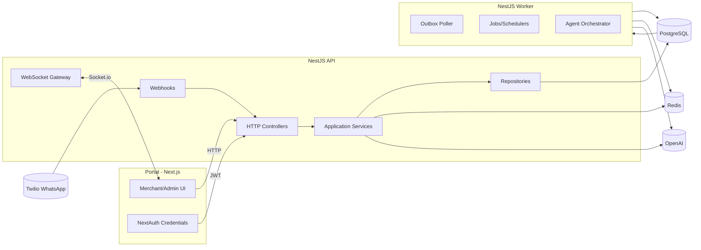
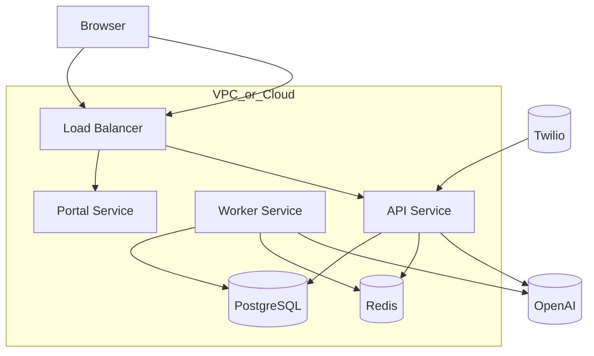
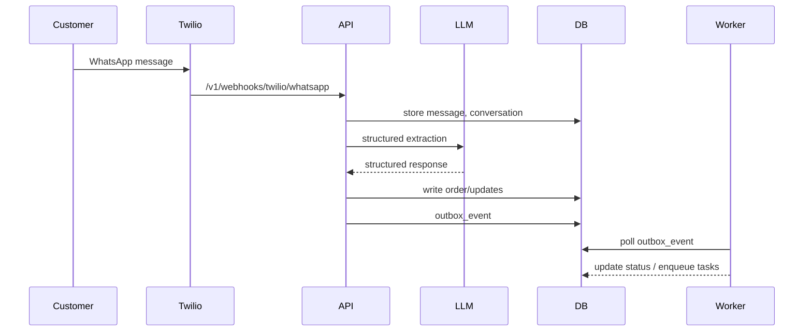
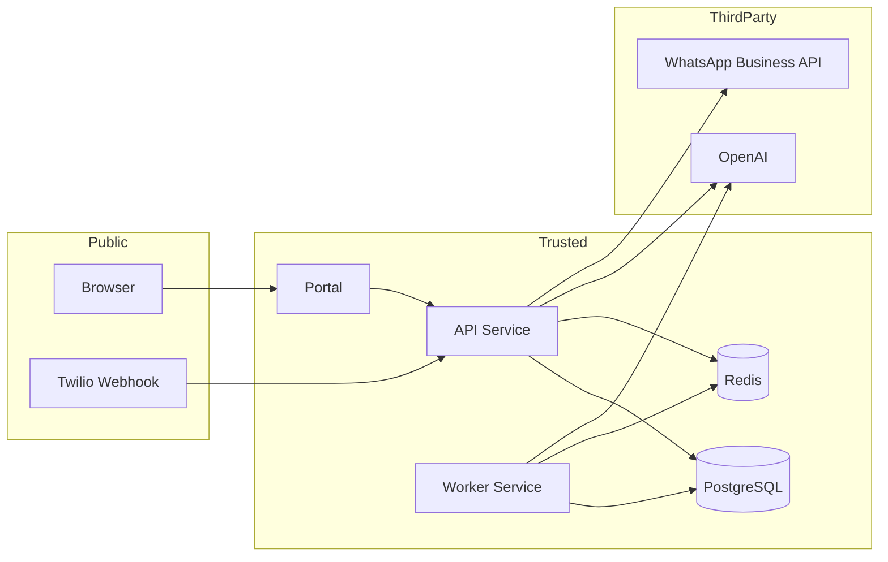

# Phase 1 - Architecture & System Understanding

## System Overview

Tash8eel is a multi-tenant conversational commerce platform for Egyptian SMBs with an API service (NestJS), background worker (NestJS), and a merchant/admin portal (Next.js). The architecture follows a hexagonal/clean layering model (API -> application -> domain -> infrastructure). Evidence: `docs/ARCHITECTURE.md:5-37`, `apps/api/src/api/api.module.ts:1-64`.

## Components

### Core Services

- **API service (NestJS)**: HTTP controllers, application services, repositories, and integrations. Evidence: `apps/api/src/api/api.module.ts:1-64`, `apps/api/src/main.ts:35-129`.
- **Worker service (NestJS)**: outbox polling, schedulers, and agent orchestration. Evidence: `apps/worker/src/main.ts:6-30`, `apps/worker/src/outbox/outbox-poller.service.ts:1-120`.
- **Portal (Next.js)**: Admin/merchant UI and NextAuth-based authentication. Evidence: `apps/portal/package.json:6-33`, `apps/portal/src/lib/auth.ts:1-154`.

### Data Stores

- **PostgreSQL**: primary data store with SQL migrations. Evidence: `docker-compose.yml:3-15`, `apps/api/migrations/001_init.sql:1-300`.
- **Redis**: caching/locks and optional rate limiting. Evidence: `docker-compose.yml:25-39`, `apps/api/src/infrastructure/redis/redis.service.ts:13-120`.

### External Services

- **OpenAI (LLM + Whisper)**: LLM and transcription adapters. Evidence: `apps/api/src/application/llm/llm.service.ts:1-120`, `apps/api/src/application/adapters/transcription.adapter.ts:138-200`.
- **Twilio WhatsApp**: inbound/outbound messaging adapter. Evidence: `apps/api/src/application/adapters/twilio-whatsapp.adapter.ts:1-120`.
- **WhatsApp Business API webhook (Meta)**: webhook endpoint skeleton. Evidence: `apps/api/src/api/controllers/webhooks.controller.ts:49-155`.

### Communication Paths

- HTTP (REST): /api/\* via NestJS controllers. Evidence: `apps/api/src/main.ts:64-67`, `apps/api/src/api/controllers/inbox.controller.ts:8-20`, `apps/api/src/api/controllers/merchants.controller.ts:15-20`.
- WebSockets: /ws namespace for realtime events. Evidence: `apps/api/src/infrastructure/websocket/events.gateway.ts:13-38`.

## End-to-End Request Flow (Primary)

### WhatsApp -> API -> DB -> Worker

1. **Inbound WhatsApp webhook** hits Twilio webhook controller.
2. **InboxService** processes message, calls OpenAI for structured extraction, writes DB records.
3. **Outbox events** are created and later consumed by the **worker**.

Evidence: `apps/api/src/api/controllers/twilio-webhook.controller.ts:53-170`, `apps/api/src/application/services/inbox.service.ts:65-200`, `apps/worker/src/outbox/outbox-poller.service.ts:34-120`.

## Authentication & Authorization

### Merchant API Key

- Merchant API key is validated by MerchantApiKeyGuard. Evidence: `apps/api/src/shared/guards/merchant-api-key.guard.ts:14-134`.

### Admin API Key

- Admin endpoints require x-admin-api-key. Evidence: `apps/api/src/shared/guards/admin-api-key.guard.ts:1-25`, `apps/api/src/api/controllers/admin.controller.ts:60-65`.

### Staff JWT (Portal)

- Portal login uses NextAuth with a credentials provider and calls /api/v1/staff/login to obtain JWTs. Evidence: `apps/portal/src/lib/auth.ts:70-144`, `apps/api/src/api/controllers/production-features.controller.ts:681-739`.
- Staff JWT creation is in StaffService. Evidence: `apps/api/src/application/services/staff.service.ts:49-583`.

### WebSocket Auth

- WebSocket gateway currently trusts client-provided merchantId for room join (no JWT verification yet). Evidence: `apps/api/src/infrastructure/websocket/events.gateway.ts:47-82`.

## Multi-Tenancy

- Primary tenant key is merchant_id in DB. Evidence: `apps/api/migrations/001_init.sql:39-200`.
- Codebase intends tenant isolation across layers. Evidence: `docs/ARCHITECTURE.md:77-81`.

## Data Model Overview (Key Tables)

Core tables include merchants, merchant_api_keys, customers, conversations, messages, orders, shipments, catalog_items, outbox_events, and dlq_events. Evidence: `apps/api/migrations/001_init.sql:39-285`.

## External Integrations List

- OpenAI (LLM + Whisper transcription). Evidence: `apps/api/src/application/llm/llm.service.ts:1-120`, `apps/api/src/application/adapters/transcription.adapter.ts:138-200`.
- Twilio WhatsApp (adapter + webhook controller). Evidence: `apps/api/src/application/adapters/twilio-whatsapp.adapter.ts:1-120`, `apps/api/src/api/controllers/twilio-webhook.controller.ts:53-200`.
- WhatsApp Business API webhook (Meta) stub. Evidence: `apps/api/src/api/controllers/webhooks.controller.ts:49-160`.
- Redis for locks/caching. Evidence: `apps/api/src/infrastructure/redis/redis.service.ts:13-120`.

## Mermaid Diagrams

### Component Diagram

### Deployment Diagram

### Data-Flow Diagram (Message Processing)

### Trust-Boundary Diagram

